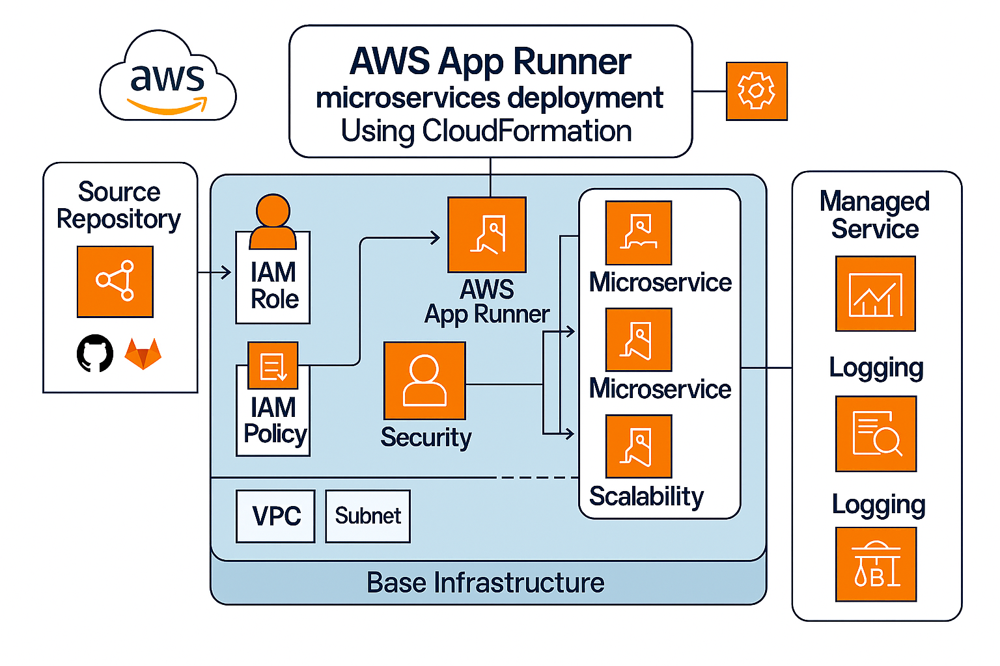

# Secure Application Infrastructure with AWS App Runner

_Production-ready, VPC-integrated, CI/CD-enabled container deployments_

## Quick Links
- [Overview](#overview)
- [Architecture](#architecture-overview)
- [Deployment Process](#deployment-process)
- [Sample Application](#sample-spring-boot-application)
- [Configuration Reference](#configuration-reference)
- [Security Architecture](#security-architecture)
- [Monitoring & Troubleshooting](#monitoring--troubleshooting)
- [Infrastructure Management](#infrastructure-management)

---

## Overview

AWS App Runner revolutionizes application development by providing a fully managed container service that automatically builds, deploys, and scales containerized applications. This infrastructure-as-code solution demonstrates how App Runner can accelerate development while maintaining enterprise-grade security through VPC integration and comprehensive security controls.

### Who is this for?
DevOps engineers, cloud architects, and teams seeking secure, automated, and scalable AWS deployments for containerized applications.

### Why AWS App Runner for Application Development?

- **Simplified Deployment**: Deploy containerized applications directly from source code or container images
- **Automatic Scaling**: Built-in auto-scaling based on traffic patterns with no infrastructure management
- **Security by Design**: Native VPC integration ensures private network access and secure database connectivity
- **Developer Productivity**: Focus on code, not infrastructure - App Runner handles the operational complexity
- **Cost Optimization**: Pay only for the compute resources your application uses

---

## Architecture Overview

This solution adheres to AWS security best practices:

- **Network Isolation**: App Runner services deployed within VPC with private subnets
- **Zero Trust Access**: No public internet exposure - access only through VPC endpoints
- **Encryption Everywhere**: Data encrypted at rest and in transit using AWS KMS
- **Least Privilege**: IAM roles with minimal required permissions
- **Secrets Management**: Database credentials and application secrets managed through AWS Secrets Manager




The infrastructure follows a two-tier architecture pattern optimized for security, scalability, and maintainability:

```
┌─────────────────────────────────────────────────────────────┐
│                    Application Tier                         │
│  ┌─────────────┐  ┌──────────────┐  ┌─────────────────┐    │
│  │ App Runner  │  │ CodePipeline │  │ ECR Repository  │    │
│  │   Service   │  │   (CI/CD)    │  │  (Container)    │    │
│  └─────────────┘  └──────────────┘  └─────────────────┘    │
└─────────────────────────────────────────────────────────────┘
                              │
                    ┌─────────────────┐
                    │ VPC Connector   │
                    │ (Secure Bridge) │
                    └─────────────────┘
                              │
┌─────────────────────────────────────────────────────────────┐
│                 Base Infrastructure Tier                    │
│  ┌─────────────┐  ┌──────────────┐  ┌─────────────────┐    │
│  │     VPC     │  │ RDS Database │  │ Secrets Manager │    │
│  │ (Multi-AZ)  │  │ (PostgreSQL) │  │   (Credentials) │    │
│  └─────────────┘  └──────────────┘  └─────────────────┘    │
└─────────────────────────────────────────────────────────────┘
```

### Infrastructure Stacks

1. **Base Infrastructure Stack** (`base-infrastructure-stack.yaml`) - Shared foundational resources. This is a one-time deployment.
2. **Application Stack** (`application-service-stack.yaml`) - Application-specific deployment resources. This gets repeated for every application/microservice.

### Base Infrastructure Components

**Networking & Security**
- **Amazon VPC**: Multi-AZ network with public, private, and database subnets
- **NAT Gateways**: Secure internet access for private resources
- **Security Groups**: Network-level access controls with least privilege principles
- **VPC Endpoints**: Private connectivity for App Runner services
- **App Runner VPC Connector**: Secure bridge between App Runner and VPC resources

**Data & Storage**
- **Amazon RDS PostgreSQL**: Managed database with encryption, automated backups, and Multi-AZ support
- **AWS KMS**: Customer-managed encryption keys for all services
- **Amazon S3**: Encrypted storage for CI/CD artifacts
- **AWS Secrets Manager**: Secure credential and configuration management

**Identity & Access**
- **IAM Roles**: Service-specific roles with minimal required permissions
- **CodeStar Connections**: Secure GitHub integration for source code access

**Operational Tools**
- **AWS Lambda**: Pipeline orchestration and synchronization
- **CloudWatch**: Comprehensive logging and monitoring

### Application Infrastructure Components

**Container Management**
- **Amazon ECR**: Private container registry with image scanning
- **AWS App Runner**: Fully managed container service with auto-scaling

**CI/CD Pipeline**
- **AWS CodePipeline**: Automated deployment pipeline
- **AWS CodeBuild**: Containerized build environment
- **GitHub Integration**: Source-driven deployments

**Application Runtime**
- **VPC Integration**: Private network access to database and internal services
- **Auto-scaling**: Automatic capacity management based on traffic
- **Health Monitoring**: Built-in health checks and observability

---

## Sample Spring Boot Application

To demonstrate the simplicity of application deployment with this infrastructure, we've included a complete Spring Boot application that showcases:

### Application Features
- **Database Integration**: Seamless PostgreSQL connectivity using Secrets Manager
- **Health Monitoring**: Built-in health checks for App Runner
- **Container Optimization**: Multi-stage Docker build for minimal image size
- **Zero Configuration**: Environment variables automatically injected from infrastructure

### Application Structure
```
src/
└── main/
    ├── java/com/example/demo/
    │   └── DemoApplication.java      # Main application class
    └── resources/
        └── application.properties     # Spring Boot configuration
pom.xml                               # Maven dependencies
Dockerfile                           # Multi-stage container build
```

### API Endpoints
- `GET /health` - Application health status
- `GET /dbtest` - Database connectivity verification

### Deployment Simplicity
With just a `git push`, the infrastructure automatically:
1. **Builds** the container image using CodeBuild
2. **Stores** the image securely in ECR
3. **Deploys** to App Runner with zero downtime
4. **Configures** database connections and secrets
5. **Scales** based on traffic automatically

**Note**: CloudFormation-related YAML and JSON files are independent and not part of the application code or build process. You need to ensure appropriate application code and Dockerfile are present to run the application in the cloud.

---

## Deployment Process

### Prerequisites

- AWS CLI v2 installed and configured with sufficient permissions
- GitHub repository with your application code
- Dockerfile in your repository root
- (Optional) Validate CloudFormation templates before deployment:
  ```bash
  aws cloudformation validate-template --template-body file://base-infrastructure-stack.yaml
  ```

### Step 1: Deploy Base Infrastructure

The base infrastructure creates the foundational security and networking components that multiple applications can share.

1. **Configure Parameters**:
   This deployment is customizable using parameters. There is a sample parameter file containing default values that can be edited based on your needs.
   ```bash
   cp base-infrastructure-parameters.json base-infrastructure-parameters-prod.json
   # Edit parameters with your specific values (VPC CIDR, database settings, etc.)
   ```

2. **Deploy Foundation Stack**:
   ```bash
   aws cloudformation deploy \
     --template-file base-infrastructure-stack.yaml \
     --stack-name your-base-infrastructure \
     --parameter-overrides file://base-infrastructure-parameters-prod.json \
     --capabilities CAPABILITY_NAMED_IAM \
     --region us-east-1 \
     --tags Project=your-project Environment=prod Owner=your-team
   ```

3. **Activate GitHub Integration**:
   - Navigate to AWS Console → Developer Tools → Settings → Connections
   - Locate your connection and select "Update pending connection"
   - Complete GitHub authorization to enable source code access
   - Remember to perform this step as this will be the last manual step in the whole process.

**What Gets Created**:
- Secure VPC with multi-AZ subnets
- RDS PostgreSQL with encryption
- KMS keys for data protection
- IAM roles and security groups
- VPC endpoints for private connectivity

### Step 2: Deploy Application Infrastructure

The application stack creates the CI/CD pipeline and App Runner service for your specific application. You need to perform this once for every application, customizing the related parameters for that application. Each microservice will have its own CloudFormation stack.

1. **Configure Application Parameters**:
   Individual application stacks can be customized using parameter files. Copy the sample `application-parameters-template.json` file with an appropriate name for your application and update it.

   > **Important:** Update the `GitHubRepo` parameter to point to your repository containing the application code and Dockerfile. This ensures the CI/CD pipeline pulls the correct source for building and deploying your application.

   ```bash
   cp application-parameters-template.json application-parameters-prod.json
   # Edit application-parameters-prod.json:
   # - Set GitHubRepo to your repo (e.g., my-org/my-app-repo)
   # - Set ServiceName and other resource requirements as needed
   ```

2. **Deploy Application Stack**:
   ```bash
   aws cloudformation deploy \
     --template-file application-service-stack.yaml \
     --stack-name your-application-service \
     --parameter-overrides file://application-parameters-prod.json \
     --capabilities CAPABILITY_NAMED_IAM \
     --region us-east-1 \
     --tags Project=your-project Environment=prod Owner=your-team Service=your-service
   ```

**What Gets Created**:
- ECR repository for container images
- CodePipeline for automated deployments
- CodeBuild project for container builds
- App Runner service with VPC integration
- Automatic scaling and health monitoring

### Step 3: Verify and Access Your Application

1. **Monitor Deployment Progress**:
   ```bash
   # Check base infrastructure outputs
   aws cloudformation describe-stacks --stack-name your-base-infrastructure --region us-east-1 --query 'Stacks[0].Outputs'

   # Check application deployment status
   aws cloudformation describe-stacks --stack-name your-application-service --region us-east-1 --query 'Stacks[0].Outputs'

   # Monitor pipeline execution
   aws codepipeline get-pipeline-state --name your-pipeline-name --region us-east-1
   ```

2. **Automatic Build Process**:
   - Pipeline automatically triggers on first deployment
   - CodeBuild creates optimized container image
   - App Runner deploys with zero-downtime
   - Auto-scaling activates based on traffic

3. **Application Access**:
   - Service accessible via VPC endpoint (private network only)
   - Domain name available in CloudFormation outputs
   - HTTPS encryption enforced by default

### Testing the Sample Application

The included Spring Boot application provides endpoints to verify deployment:

```bash
# Health status check
curl https://<app-runner-domain>/health
# Response: OK

# Database connectivity test
curl https://<app-runner-domain>/dbtest
# Response: DB Connection: SUCCESS
```

---

## Configuration Reference

### Base Infrastructure Parameters

| Parameter | Description | Default |
|-----------|-------------|----------|
| ProjectName | Project name for resource naming | - |
| Environment | Environment (dev/staging/prod) | prod |
| Owner | Team or owner name | - |
| VpcCidr | VPC CIDR block | 10.0.0.0/20 |
| DatabaseName | Database name | appdb |
| DatabaseUsername | Database master username | dbadmin |
| DatabaseInstanceClass | RDS instance class | db.t3.small |
| DatabaseAllocatedStorage | Database storage in GB | 20 |
| EnableMultiAZ | Enable Multi-AZ for RDS | false |
| Region | AWS Region for deployment | us-east-1 |

### Application Parameters

| Parameter | Description | Default |
|-----------|-------------|----------|
| ServiceName | Name of the service/application | - |
| GitHubRepo | GitHub repository (owner/repo) | - |
| BaseInfrastructureStackName | Base infrastructure stack name | - |
| ContainerPort | Application container port | 8080 |
| AppRunnerCpu | CPU units (256-4096) | 1024 |
| AppRunnerMemory | Memory in MB | 2048 |
| CreateSecretsConfig | Configure database secrets | true |
| Region | AWS Region for deployment | us-east-1 |

### Environment Variables

When `CreateSecretsConfig` is enabled, the following environment variables are available to your application:

- `DB_URL` - Complete database connection string
- `DB_USER` - Database username
- `DB_PASSWORD` - Database password
- `DB_HOST` - Database host
- `DB_PORT` - Database port
- `DB_NAME` - Database name

---

## Security Architecture

### Defense in Depth
- **Network Isolation**: Multi-layer VPC design with public, private, and database subnets
- **Zero Trust Access**: No public internet exposure for application or database
- **Encryption Everywhere**: KMS encryption for data at rest and in transit
- **Identity-Based Access**: IAM roles with least privilege principles
- **Secrets Protection**: AWS Secrets Manager for credential lifecycle management

### Compliance & Governance
- **Audit Trail**: CloudTrail logging for all API calls
- **Resource Tagging**: Comprehensive tagging for cost allocation and governance
- **Access Controls**: Security groups with minimal required permissions
- **Data Protection**: Automated backups with encryption
- **Network Security**: Private subnets and VPC endpoints for secure communication

---

## Monitoring and Logging

- CloudWatch Logs for all services
- RDS Enhanced Monitoring (production only)
- ECR image scanning enabled
- Pipeline execution logs in CloudWatch

---

## Infrastructure Management

### Scaling Applications

To deploy additional applications using the same base infrastructure:

1. **Reuse Base Infrastructure**: Multiple application stacks can reference the same base infrastructure
2. **Update Parameters**: Create new parameter files for each application
3. **Deploy Additional Stacks**: Each application gets its own CI/CD pipeline and App Runner service

### Multi-Application Deployment

```bash
# Deploy multiple applications using shared base infrastructure
aws cloudformation deploy --template-file application-service-stack.yaml \
  --stack-name frontend-service --parameter-overrides ServiceName=frontend GitHubRepo=org/frontend-app

aws cloudformation deploy --template-file application-service-stack.yaml \
  --stack-name api-service --parameter-overrides ServiceName=api GitHubRepo=org/api-service
```

### Infrastructure Modifications

- **Base Infrastructure Changes**: Update and redeploy base stack - all applications automatically inherit changes
- **Application-Specific Changes**: Modify individual application stacks without affecting others
- **Environment Promotion**: Use same templates across dev/staging/prod with different parameters

### Cleanup Process

When decommissioning infrastructure:

1. **Delete Application Stacks First**:
   ```bash
   aws cloudformation delete-stack --stack-name your-application-service --region us-east-1
   aws cloudformation wait stack-delete-complete --stack-name your-application-service --region us-east-1
   ```

2. **Delete Base Infrastructure**:
   ```bash
   aws cloudformation delete-stack --stack-name your-base-infrastructure --region us-east-1
   aws cloudformation wait stack-delete-complete --stack-name your-base-infrastructure --region us-east-1
   ```

**Important**: Ensure ECR repositories and S3 buckets are empty before stack deletion to prevent errors. Also remember to remove termination protection from RDS when environment is prod.

---

## Monitoring & Troubleshooting

### Observability

```bash
# Monitor application health
aws apprunner describe-service --service-arn <service-arn> --region us-east-1

# View application logs
aws logs tail /aws/apprunner/<service-name> --follow

# Check pipeline status
aws codepipeline get-pipeline-state --name <pipeline-name> --region us-east-1

# Monitor build logs
aws logs tail /aws/codebuild/<project-name> --follow
```

### Common Troubleshooting

| Issue | Solution |
|-------|----------|
| GitHub Connection Pending | Activate connection in AWS Console → Developer Tools → Connections |
| Pipeline Build Fails | Check CodeBuild logs in CloudWatch for build errors |
| App Runner Deploy Fails | Verify Dockerfile syntax and container port configuration |
| Database Connection Issues | Validate security group rules and VPC connectivity |
| Application Not Accessible | Confirm VPC endpoint configuration and DNS resolution |

### Performance Optimization

- **Container Optimization**: Use multi-stage Docker builds to minimize image size
- **Database Performance**: Enable RDS Performance Insights for production workloads
- **Cost Management**: Monitor App Runner scaling metrics and adjust CPU/memory allocation
- **Security Scanning**: Enable ECR image scanning for vulnerability detection

---

## Getting Started

1. **Clone this repository**
2. **Configure your parameters** in the JSON files
3. **Deploy base infrastructure** first
4. **Deploy your application** stack
5. **Push code changes** - automatic deployment handles the rest!

This infrastructure provides a production-ready foundation for containerized applications with enterprise-grade security, automatic scaling, and operational simplicity.

---

## FAQ & Support

**Q: Can I use my own application instead of the sample?**  
A: Yes! Replace the sample Spring Boot app with your own code and Dockerfile.

**Q: Where do I get help?**  
A: Open a GitHub issue or consult AWS Support for infrastructure-related questions.

---

## Contributing & License

Contributions are welcome! Please open issues or pull requests for improvements.

This project is licensed under the MIT License. See [LICENSE](./LICENSE) for details.